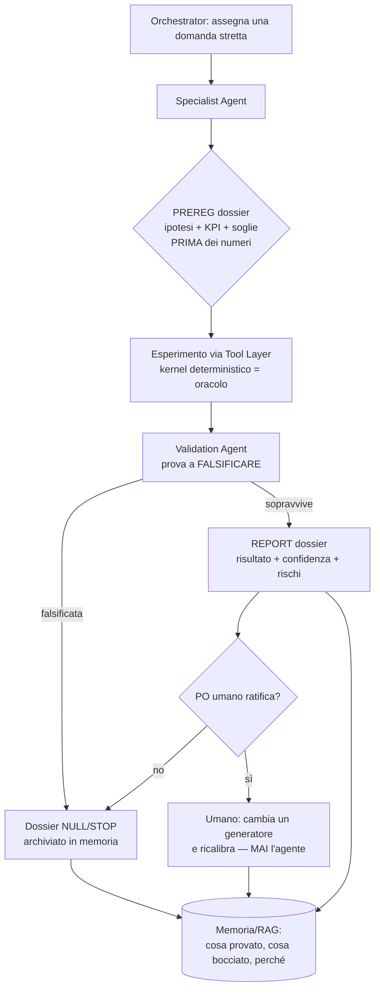

# MURETTO AI LAB — ARCHITETTURA v1

*Documento di architettura. NON è codice, NON tocca il repository.*
*Autore: technical architect. Data: 2026-07-20.*
*Regola guida: la soluzione più semplice che possa crescere per anni. Un laboratorio di ricerca sopra un simulatore deterministico, non un chatbot.*

---

## 1. Executive summary

Muretto Box Virtuale è già un laboratorio di ricerca — ma condotto **a mano**. Il repository non è "un simulatore con dei report intorno": è un **motore deterministico congelato** (`engine/engine.py`) circondato da un metodo scientifico rigoroso e ripetuto (PREREG → esperimento → REPORT → cancello GO/NO-GO/NULL/STOP), con un confine non negoziabile — *"automatizza la fatica, MAI il giudizio"* (`pipeline_gara.py`).

Il **Muretto AI Lab** non aggiunge intelligenza *dentro* il motore. Aggiunge un **livello cognitivo sopra** che fa esattamente ciò che oggi fa Tommi a mano, ma con più braccia: legge lo stato, confronta simulazione e realtà, trova anomalie, scrive ipotesi pre-registrate, prova a falsificarle, e consegna dossier a un umano che ratifica. Il kernel resta la fonte di verità; il replay resta il giudice; l'umano resta l'unico che può cambiare un coefficiente.

Tre principi portanti, tutti **ereditati** dal sistema esistente e non inventati qui:

1. **Fonte = verità.** Gli agenti leggono fatti grezzi e il verdetto del motore, mai "opinioni". Il replay del motore sul reale è l'oracolo.
2. **Confine non negoziabile.** Nessun agente scrive nel kernel, nei coefficienti, nella telemetria o in `demo/`. Gli agenti producono *dossier*, non *commit*.
3. **Ipotesi, non miglioramenti.** Mai *"ho migliorato il modello"*. Sempre *"ho trovato un'ipotesi che richiede validazione"*. Questo è già la cultura dei file `PREREG_*`/`REPORT_*`.

La proposta tecnica è deliberatamente **povera di tecnologia**: nessun database nuovo obbligatorio, nessuna GPU, nessun microservizio. Un **Tool Layer read-only** che avvolge il codice che già esiste, agenti Claude (Agent SDK / Claude Code) coordinati da un Orchestrator, e un **corpus di dossier su filesystem + git** come memoria. Si aggiunge complessità (indice vettoriale, ledger SQLite) solo quando il filesystem smette di bastare — non prima.

**Prima milestone concreta (Sezione 15):** un Auditor Agent che riproduce da solo *una* scoperta già nota e umana-verificata (es. il doppio-conteggio del degrado, BIAS +0.42 di `REPORT_FASEB.md`), la scrive come dossier, e la fa passare al Validation Agent — senza toccare nulla. Se il loop riproduce una verità che già conosciamo, allora è affidabile per cercarne di nuove.

---

## 2. Analisi dell'architettura attuale

Il sistema realizza letteralmente **DATI → MODELLI → MOTORE → OUTPUT**. Ecco dove vive ogni strato.

### 2.1 Il motore (fonte di verità) — `engine/engine.py`

95 righe. È il cuore e va capito prima di tutto:

- **Stato immutabile.** `CarObs` e `RaceState` sono `@dataclass(frozen=True)`; le mappe sono `MappingProxyType` (immutabili a runtime). Lo stato non si muta: si *ricrea*.
- **Modelli componibili.** Ogni modello è un oggetto con `.apply(state) -> state`:
  - `PaceModel` → passo-base **corretto per il carburante** (`pace_base`, `FUEL_COEFF=3/70`, serbatoio vuoto come riferimento);
  - `TrafficModel` → recupero in aria sporca (zona 1.5s, forza configurabile);
  - `AdvanceModel` → avanza il tempo di un giro.
- **Kernel puro.** `SimulationKernel.run(state0, models, n_steps)` compone i modelli in sequenza. Nessuna probabilità, nessuno stato nascosto, nessun I/O. **Deterministico**: stesso input → stesso output, sempre.
- **Adapter dati.** `ti_adapter` converte il grezzo TracingInsights in una lista di `RaceState` per giro. `load(gara)` scarica/cache-a i laptime.

Questo motore è **congelato**. La sua immutabilità non è una convenzione: è imposta dal linguaggio (`frozen=True`). È il singolo componente che gli agenti non devono toccare mai.

### 2.2 Lo specchio del motore — `demo/engine.mjs`

Reimplementazione JS fedele (Pace → Traffic → Advance) per girare nel browser. Vige la **"legge del replay"**: la demo deve riprodurre il motore. Le due implementazioni devono restare bit-coerenti; ogni divergenza è un bug.

### 2.3 I modelli / la calibrazione (MODELLI) — i generatori `gen_*.py`

~40 generatori producono **artefatti-coefficiente** (JSON/CSV), ciascuno con un `REPORT_*` che lo giustifica. I principali:

| Dominio | Generatore | Artefatto | Note dal repo |
|---|---|---|---|
| Degrado | `gen_climatologia_degrado.py`, `gen_banda_degrado_validazione.py`, `gen_degrado_storico_core5.py` | `climatologia_bande.json`, bande | Arco a 5 cancelli, 5 NULL/STOP onorati |
| Neutralizzazione | `gen_neutralizzazione_v2.py` | `neutralizzazione.json` | 39 codici status; SC risanata, **VSC ancora rotta (1.055)** |
| Pit-loss | `gen_pitloss_engine_ready.py`, `gen_pitloss_pergara.py` | `pitloss.json` + `pitloss_meta.json` | **Architettura a due parametri** (realizzato per-gara / tipico circuito); provenienza tracciata nel meta |
| Sorpasso/traffico | `gen_difficolta_sorpasso.py` | difficoltà per circuito | Alimenta il `TrafficModel` |
| Race control | `gen_race_control.py`, `gen_rc_feed.py` | `race_control_2026.json` | Arbitro = FastF1 results |

**Strategia** (il cuore del prodotto "Box Verstappen ora") vive in `demo/`, lato client:
- `pitscenario.mjs` → `evaluatePit(...)`: rientro, davanti/dietro, gap, **soppressione onesta dei gap sotto neutralizzazione** (null, non numero-con-cerotto);
- `pitbande.mjs` → scenari di degrado (adapter M1, `rate*(A-A0)`, corregge il doppio-conteggio);
- `att6*.mjs`, `degrado_hook.mjs`, `backtest_undercut.mjs` → strumenti di undercut e replay.

### 2.4 I dati (DATI)

- **Storico:** TracingInsights (`data/ti_cache/`, `data/ti_archive/`) e f1db (griglie, risultati, pitstop) via `ingest_*.py`. Regola ferrea: *"Fonte = verità. Trascrizione umana = bug in attesa"* (`TODO.md`).
- **Live:** `live/collector/collector.py`, daemon sul **VPS Hetzner** (`167.233.236.186`). Ingressi: SignalR ufficiale (ricostruito su `signalrcore`, specchio di fastf1 3.8.3) e **OpenF1 MQTT** (fallback per il **blocco CloudFront** che rifiuta gli IP datacenter). Decoder + replay condividono **un solo percorso di codice** (live ≡ replay, verificato e2e). Serve WebSocket su `ws.murettobox.com` via Caddy TLS. `inpit_geometrico.py` classifica il pit-lane dalla geometria.
- **Pipeline di pubblicazione:** `pipeline_gara.py` porta una gara da TI alla demo, **semi-automatica**, con **guardrail dichiarati** (completezza, dry-check, sanità + smoke-test del modulo pit) e **checkpoint umano obbligatorio** prima di pubblicare. Il *"CONFINE NON NEGOZIABILE"*: non ricalcola mai coefficienti motore, non tocca griglie, non tocca la telemetria.

### 2.5 L'output / il frontend (OUTPUT)

- Statico: HTML + `.mjs` in `demo/`, dati **serializzati come JSON**, deploy su **Vercel**. `gara.html` fa `fetch` di ~15 file JSON e importa i moduli strategia.
- Unica funzione serverless: `demo/api/contatore.js` (contatore anonimo, solo interi, Upstash Redis; privacy by construction).
- Live UI: `demo/live.html` + `live_mappa.mjs` consumano il WebSocket del VPS.

### 2.6 Il metodo scientifico (già presente, manuale)

Questo è il ritrovamento più importante per il Lab. Il progetto **pratica già** un ciclo formale:

```
PREREG_SESSIONE_*.md   (ipotesi + KPI + soglie, committato PRIMA dei numeri)
        ↓
esperimento (gen_*.py / test_*.mjs, in-sample o leave-out)
        ↓
REPORT_*.md            (risultato + confidenza + verdetto)
        ↓
CANCELLO: GO / NO-GO / NULL / STOP   (onorato anche quando dice "no")
```

L'"arco degrado" ha attraversato **5 cancelli e ha onorato 5 NULL/STOP**. Il Research Dossier chiesto nella Fase 4 **non è una novità da inventare**: è la formalizzazione di `PREREG_*`/`REPORT_*`. Il Lab deve *innestarsi* su questo formato, non affiancarne uno parallelo.

---

## 3. Componenti da preservare (non toccare mai)

Elenco esplicito, in ordine di intoccabilità:

1. **`engine/engine.py`** — il kernel. Congelato. Immutabilità imposta da `frozen=True`. Zero probabilità al suo interno.
2. **`demo/engine.mjs`** — lo specchio. Deve restare fedele al kernel (legge del replay).
3. **La telemetria e il collettore live** (`live/collector/*`) — percorso unico live/replay, credenziali (`~/.openf1.env`, `f1auth.json`) fuori da git e fuori dalla portata degli agenti.
4. **Gli artefatti-coefficiente pubblicati** (`demo/data/*.json`, `data/*.csv`) — cambiabili solo dai generatori, e solo con ratifica umana.
5. **`pipeline_gara.py` e il suo confine** — l'idraulica è automatizzabile; il giudizio no. Il checkpoint umano resta.
6. **La griglia** (`grids.json`) e le fonti storiche — fonte = verità, mai trascrizione.

**Regola operativa:** il Lab ottiene accesso a questi componenti **solo in lettura**, e solo attraverso il Tool Layer (Sezione 7). Nessun agente ha un handle di scrittura verso questa lista.

---

## 4. Nuova architettura proposta

Il Lab è un **anello esterno** attorno al sistema esistente. Non lo penetra: lo interroga tramite strumenti e ne osserva l'output deterministico.

```
                      ┌──────────────────────────────────────────────┐
                      │              MURETTO AI LAB                   │
                      │            (anello esterno, nuovo)            │
                      │                                               │
   umano (PO) ⇄  ┌────┴─────┐    assegna    ┌──────────────────┐      │
   ratifica      │ ORCHESTR.│ ────────────▶ │ AGENTI SPECIALIST│      │
                 │  (coord.)│ ◀──────────── │ Auditor/Tyre/... │      │
                 └────┬─────┘   dossier      └────────┬─────────┘      │
                      │                               │ chiamano       │
                      │        ┌──────────────────────▼─────────────┐ │
                      │        │           TOOL LAYER (read-only)    │ │
                      │        │  getRaceState / simulatePitStop /   │ │
                      │        │  compareRealitySimulation / ...     │ │
                      │        └──────────┬──────────────────────────┘ │
                      │                   │ SOLO lettura + run puro     │
                      │        ┌──────────▼─────────┐  ┌─────────────┐  │
                      │        │  MEMORIA / RAG     │  │  LEDGER     │  │
                      │        │  (dossier + corpus)│  │ esperimenti │  │
                      │        └────────────────────┘  └─────────────┘  │
                      └───────────────────┼──────────────────────────────┘
                                          │ (confine: sola lettura, run isolato)
   ═══════════════════════════════════════▼══════════════════════════════════
                      SISTEMA ESISTENTE (congelato, fonte di verità)
   engine/engine.py │ demo/engine.mjs │ gen_*.py + artefatti │ live/collector │ demo/ (Vercel)
```

Punti chiave del disegno:

- **Il confine è il Tool Layer.** Gli agenti non aprono file del kernel, non eseguono `gen_*.py` in scrittura, non fanno `git commit`. Vedono solo ciò che un tool espone, e i tool sono read-only o run-in-sandbox.
- **Il motore resta l'oracolo.** Quando un agente vuole sapere "cosa succede se boxo Verstappen al giro 22", non *stima*: chiama `simulatePitStop`, che gira il kernel deterministico. L'LLM ragiona *sopra* il risultato del motore, non *al posto* del motore.
- **L'umano è nel loop, come già oggi.** L'Orchestrator consegna dossier; il PO ratifica; solo un umano tocca un coefficiente. È lo stesso checkpoint di `pipeline_gara.py`, esteso al Lab.
- **Isolamento.** Ogni esperimento gira in un **git worktree** dedicato (già in uso in questo progetto), così un agente non può mai sporcare l'albero di lavoro principale.

---

## 5. Diagrammi

### 5.1 Il ciclo di un dossier (workflow logico)



### 5.2 Il confine di sicurezza (chi può scrivere cosa)

```
                 leggere   simulare   scrivere dossier   scrivere kernel/coeff.
Agenti Lab          ✓          ✓             ✓                    ✗
Tool Layer          ✓          ✓ (sandbox)   ✗                    ✗
Orchestrator        ✓          –             ✓ (indice)           ✗
PO umano            ✓          ✓             ✓                    ✓  (unico)
```

### 5.3 Dove gira ogni cosa (fisico) — vedi Sezione 6.

---

## 6. Infrastruttura — distribuzione dei componenti

Nessuna GPU. Il motore non è ML: è aritmetica deterministica su poche migliaia di giri. Non c'è nulla da addestrare che richieda una GPU, e dirlo esplicitamente è parte dell'onestà del progetto.

| Componente | Dove | Perché |
|---|---|---|
| **Orchestrator + agenti** | **Locale (MacBook Air M4)** via Claude Code / Agent SDK | Il codice, il motore e il corpus sono già lì; il worktree isola gli esperimenti; nessuna latenza verso i file. |
| **Tool Layer** | **Locale** (stessi processi Python/JS del repo) | I tool sono thin wrapper sul codice esistente: girano dove gira il codice. |
| **Ragionamento LLM** | **Claude API** | L'unica dipendenza esterna. Opus per Auditor/Validation (giudizio), Sonnet/Haiku per lavori meccanici (estrazione, indicizzazione). |
| **Memoria / RAG / Ledger** | **Locale + git** | Dossier come file `.md`, versionati; git È l'audit log. Indice vettoriale solo se/quando serve (Sez. 10). |
| **Collettore live** | **VPS Hetzner (già attivo)** | Deve stare su un IP sempre-acceso; resta com'è. Il Lab lo *legge* (registrazioni in `data/live_raw/`), non ci gira dentro. |
| **Frontend + contatore** | **Vercel (già attivo)** | Invariato. Il Lab non pubblica mai su Vercel. |

**Cosa NON serve:** nessun Postgres, nessun Kafka, nessun cluster, nessun vector DB gestito, nessuna GPU, nessun nuovo servizio always-on. Il Lab è un processo che si accende quando lavori, e si spegne quando hai finito. Cresce aggiungendo tool e agenti, non macchine.

Nota sul VPS: se un giorno vorrai far girare uno **shadow-run live** non presidiato (Fase C del piano degrado), l'agente-shadow potrà girare sul VPS accanto al collettore — ma **solo in modalità calcola-e-registra**, mai pubblica. Anche lì il confine regge.

---

## 7. Tool necessari (il Tool Layer)

Gli agenti **non leggono il codice sorgente per calcolare**: chiamano strumenti tipizzati. Ogni tool avvolge codice che **già esiste**, così il Lab non reintroduce logica che potrebbe divergere dal motore.

### 7.1 Lettura dello stato (read-only)

| Tool | Avvolge | Ritorna |
|---|---|---|
| `listRaces()` | `demo/data/manifest.json` | gare disponibili, n_giri, n_piloti |
| `getRaceState(gara, lap)` | `ti_adapter` / `byLap` | stato di tutti i piloti al giro |
| `getDriverState(gara, lap, drv)` | idem | passo-base, stint, gomma, età, cum_time, neutralizzato |
| `getTyreData(gara, drv?)` | stint + `climatologia_bande.json` + bande degrado | compound, età, finestra, banda degrado |
| `getTrafficData(gara)` | `gen_difficolta_sorpasso` output | difficoltà sorpasso, zona/forza traffico |
| `getPitLoss(gara)` | `pitloss.json` + `pitloss_meta.json` | valore + **provenienza** (realizzato/tipico/non-misurato) |
| `getRaceControl(gara)` | `race_control_2026.json` | bandiere, SC/VSC, penalità |
| `getNeutralization(gara)` | `neutralizzazione.json` | finestre SC/VSC reali, durata tipica |

### 7.2 Simulazione (run puro, sandbox)

| Tool | Avvolge | Nota |
|---|---|---|
| `simulatePitStop({gara, drv, freezeLap, pitLap, pitLoss})` | `demo/engine.mjs` `simulate` / kernel | run deterministico; nessuno stato persistito |
| `getStrategyResult({...})` | `pitscenario.mjs` `evaluatePit` | rientro, davanti/dietro, gap, soppressione onesta sotto neutralizzazione |
| `runDegradationScenarios({...})` | `pitbande.mjs` (adapter M1) | i tre scenari degrado calibrati |

### 7.3 Confronto realtà↔simulazione (il cuore dell'Auditor)

| Tool | Avvolge | Ritorna |
|---|---|---|
| `compareRealitySimulation({gara, drv, lap})` | `gen_replay_perdita_stint.py`, `backtest_undercut.mjs` | delta simulato vs reale (cum_time), residuo, contesto (neutralizzato? traffico?) |
| `replayStint({gara, drv, stint})` | replay | traiettoria simulata vs osservata giro-per-giro |

### 7.4 Memoria e ricerca (RAG)

| Tool | Avvolge | Ritorna |
|---|---|---|
| `searchCorpus(query)` | corpus `PREREG_*`/`REPORT_*`/`NOTA_*`/memory | passaggi rilevanti + provenienza |
| `getDossier(id)` / `listDossiers(filtro)` | ledger | dossier passati, verdetti, cosa fu bocciato e perché |
| `getArtifactProvenance(nome)` | `*_meta.json`, header dei generatori | chi ha prodotto un file, con quale metodo (smaschera i **file orfani** = debito) |

### 7.5 Esperimenti (l'unico "quasi-scrittura", ma isolato)

| Tool | Effetto | Confine |
|---|---|---|
| `runExperiment(prereg)` | esegue un run in **worktree isolato**, logga nel ledger | non tocca `demo/`, `engine/`, `data/` pubblicati; scrive solo nell'area Lab |
| `writeDossier(dossier)` | salva un `.md` nell'area Lab + aggiorna l'indice | mai in `demo/`; mai `git commit` automatico |

**Regola sui tool:** ogni tool che *legge un modello* deve chiamare il codice del modello, non reimplementarlo. Se un tool dovesse "ricalcolare" il pace-base per conto suo, sarebbe un secondo motore che diverge — esattamente il rischio che `demo/engine.mjs` gestisce con la legge del replay.

---

## 8. Agenti specializzati

Ogni agente ha **uno scopo stretto**, **i suoi tool**, e produce **dossier**, mai commit. La divisione riflette i domini già presenti nel repo (degrado, traffico, pit, neutralizzazione).

### 8.1 Orchestrator
Coordinatore. Riceve dal PO una domanda o una gara appena pubblicata, la spezza in **domande strette** (una alla volta — come i PREREG), assegna allo specialista giusto, raccoglie i dossier, interpella il Validation Agent, e presenta al PO una coda ratificabile. Non ragiona sul dominio: instrada e tiene la contabilità. Tool: `listRaces`, `searchCorpus`, `listDossiers`.

### 8.2 Auditor Agent
**Scopo:** trovare le differenze tra realtà e simulatore. È il cane da guardia.
Esempio: *"Ad Austria, Norris guadagna 4s reali con l'undercut; il simulatore ne calcola 1.2 → ipotesi: il pit-loss verde sovrastima, oppure il TrafficModel non modella il rientro in aria pulita."*
Tool: `compareRealitySimulation`, `replayStint`, `getRaceState`, `getPitLoss`, `getNeutralization`. Output: dossier con l'anomalia, MAI la correzione.

### 8.3 Tyre Agent
**Scopo:** degrado, warm-up, temperatura, compound, finestra gomme. Conosce l'"arco degrado" (5 cancelli, banda statica che batte la live-aggiornata, doppio-conteggio corretto con M1). Tool: `getTyreData`, `runDegradationScenarios`, `replayStint`, `searchCorpus`. Deve **sapere cosa è già stato bocciato** (la memoria glielo dice) per non riproporlo.

### 8.4 Traffic Agent
**Scopo:** aria sporca, sorpassi, treni DRS, traffico dopo il pit. È il naturale sospettato quando l'Auditor trova un residuo sull'undercut. Tool: `getTrafficData`, `simulatePitStop` (variando `ZONE`/`STRENGTH`), `compareRealitySimulation`.

### 8.5 Pit Agent
**Scopo:** pit-lane time, ingresso/uscita, undercut/overcut. Conosce l'architettura a due parametri del pit-loss e la provenienza (realizzato/tipico). Tool: `getPitLoss`, `getArtifactProvenance`, `simulatePitStop`, `compareRealitySimulation`.

### 8.6 Safety Car Agent
**Scopo:** SC, VSC, neutralizzazioni. Sa che **la VSC è ancora rotta (1.055)** e che i gap sotto neutralizzazione sono soppressi onestamente. Tool: `getNeutralization`, `getRaceControl`, `replayStint`. Un candidato ovvio per il primo lavoro reale: la VSC è un problema aperto e documentato.

### 8.7 Validation Agent — *il più importante*
**Scopo:** distruggere le ipotesi degli altri. Prima che un dossier arrivi al PO, il Validation Agent tenta di **falsificarlo**, con un armamentario preciso che nasce dagli errori già commessi in questo progetto:

- **Copertura circolare / in-sample:** se l'ipotesi è "validata" sugli stessi dati da cui è nata, è sospetta. Chiede un test leave-out (la memoria `fonte-orfana-e-copertura-circolare` documenta questa trappola).
- **Doppio conteggio:** un effetto sommato sopra un altro già presente (il caso `rate*(età-1)` sopra un pace-base già degradato, BIAS +0.42).
- **Noise-floor vs fisica:** un "miglioramento" più piccolo del rumore non è un miglioramento (memoria `pace-base-fuel-corretto`).
- **File orfano:** un artefatto senza generatore è **debito, non fonte**. Chiede la provenienza.
- **Confusione degrado↔evoluzione pista** nei primi giri (cancello intragara).

Se il dossier sopravvive, passa; altrimenti diventa un dossier NULL/STOP — anch'esso prezioso (dice cosa NON fare). Tool: tutti in lettura + `runExperiment` per contro-prove.

### 8.8 (Ruolo di servizio) Librarian
Non è un agente di dominio: mantiene la memoria coerente — indicizza i dossier, collega quelli correlati, segnala duplicati, cura il manifest. Può essere un agente leggero (Haiku) o un semplice script. Tool: `searchCorpus`, `writeDossier` (solo indice).

---

## 9. Metodo scientifico — il Research Dossier

Formato unico, **innestato su `PREREG_*`/`REPORT_*` esistenti**. Un dossier ha due fasi: la parte PRE (committata prima dei numeri) e la parte POST (aggiunta dopo). Questo impedisce di reinventare l'ipotesi a posteriori per farla combaciare.

```markdown
# DOSSIER <id> — <titolo stretto>
stato: PREREG | REPORT | NULL | STOP | RATIFICATO
agente: <nome> | validato_da: <Validation Agent>
gara/e: <...> | data_prereg: <...> | data_report: <...>

## PRE (prima dei numeri)
- Problema trovato:            <una anomalia concreta, con numeri grezzi>
- Ipotesi:                     <UNA, falsificabile>
- Dati utilizzati:             <gare, giri, fonte, in-sample vs leave-out>
- Metodo:                      <come si misura, quali tool>
- Campione:                    <numerosità, copertura>
- KPI e soglia:                <dichiarati ORA, non dopo>
- Rischi noti a priori:        <circolarità? doppio conteggio? noise-floor?>

## POST (dopo i numeri)
- Risultato:                   <numeri>
- Confidenza:                  <IC / dimensione effetto vs rumore>
- Esito validazione:           <cosa ha provato il Validation Agent, con quale esito>
- Possibile miglioramento:     <descritto, NON applicato>
- Test necessario prima di applicarlo: <leave-out, replica, gara nuova>
- Verdetto:                    GO ipotesi promettente / NO-GO / NULL / STOP
```

Regola linguistica, imposta agli agenti nel system prompt: **mai** *"ho migliorato il modello"*; **sempre** *"ho trovato un'ipotesi che richiede validazione"*. La differenza non è cosmetica: un agente che crede di aver migliorato qualcosa spinge per applicarlo; un agente che ha trovato un'ipotesi la consegna al giudizio.

---

## 10. Memoria e RAG

Gli agenti devono ricordare **cosa è stato provato, cosa è stato bocciato, e perché**. La buona notizia: questo corpus **esiste già** — i ~70 file `PREREG_*`/`REPORT_*`/`NOTA_*` e le memorie di progetto sono precisamente questa storia. Il Lab non parte da zero.

**Strategia in tre stadi, si sale solo quando serve:**

1. **Stadio 0 — filesystem + git (subito).** I dossier sono file `.md` in un albero `lab/dossier/`, con un `INDEX.md` (una riga per dossier, come già fa `MEMORY.md`). git è l'audit log immutabile: chi, quando, cosa. `searchCorpus` inizia con ricerca strutturata + grep sui titoli/frontmatter. Per mesi questo basta: il corpus è dell'ordine delle centinaia di documenti, non milioni.
2. **Stadio 1 — indice vettoriale locale (quando il grep non trova più).** Un embedding locale (es. sqlite + un modello di embedding piccolo, tutto sul M4) su chunk dei dossier e dei report. Nessun servizio gestito. Si aggiunge **solo** quando la ricerca lessicale inizia a mancare collegamenti reali — non prima, per non pagare complessità che non serve.
3. **Stadio 2 — grafo delle decisioni (eventuale, lontano).** Collegamenti espliciti "questa ipotesi supera/contraddice quella" à la wiki-link `[[...]]` già usato nelle memory. Utile solo se il numero di ipotesi correlate diventa ingestibile a occhio.

**Cosa entra in memoria:** dossier (PRE e POST), verdetti dei cancelli, runbook, decisioni del PO, e i puntatori agli artefatti con la loro provenienza. **Cosa NON entra:** ciò che il repo già registra (struttura del codice, git history) — la memoria non duplica la fonte, la indicizza.

---

## 11. Database

Domanda onesta: **serve un database?** Per lo Stadio 0, no. Un possibile aggiunta minima e giustificata è un **ledger degli esperimenti** in **SQLite** (un file, zero server), con una tabella:

```
esperimenti(id, dossier_id, agente, gara, prereg_hash, kpi, soglia,
            risultato, confidenza, esito_validazione, verdetto, worktree_ref, timestamp)
```

Perché SQLite e non Postgres: un file, nessun processo, versionabile/backup-abile con un `cp`, gira ovunque sul M4, e regge milioni di righe ben oltre l'orizzonte del progetto. Il `prereg_hash` (hash del blocco PRE) impedisce l'HARKing: se il risultato non combacia con l'ipotesi pre-registrata, si vede.

Gli **artefatti del motore** (JSON/CSV) restano dove sono — non migrano in un DB. Sono la fonte, e la fonte è file versionati, come vuole il progetto.

---

## 12. RAG — flusso concreto

Quando un agente lavora su "undercut Austria":

1. `searchCorpus("undercut Austria degrado traffico")` → recupera `UNDERCUT_NOTA.txt`, i report undercut, i cancelli traffico rilevanti, e i dossier passati con verdetto.
2. L'agente legge **prima cosa è già stato bocciato** (evita di riproporre un NULL noto).
3. Interroga i tool di lettura per i fatti grezzi (`getRaceState`, `getPitLoss` con provenienza).
4. Formula il PRE del dossier, lo committa (hash).
5. `runExperiment` in worktree isolato → numeri.
6. Validation Agent recupera via RAG le trappole note e prova a falsificare.
7. POST del dossier + verdetto → coda del PO.

Il RAG non è un accessorio: è il meccanismo che rende gli agenti **coscienti della storia del progetto**, così non ripetono i cinque NULL già onorati.

---

## 13. Sicurezza

Il modello di minaccia ha tre facce: (a) l'agente che rompe il motore, (b) il dato live avvelenato, (c) la fuga di credenziali.

- **Kernel intoccabile — a più livelli.** Nessun tool espone scrittura su `engine/`, `demo/`, `data/` pubblicati. In più il kernel è già immutabile a runtime (`frozen=True`): anche un tool che provasse a mutare uno stato fallirebbe. Nessun `git commit`/`push` automatico: il deploy resta un gesto umano esplicito (come già per il collettore e la pipeline).
- **Isolamento degli esperimenti.** Ogni `runExperiment` in un **git worktree** dedicato, distrutto a fine run. Un agente non vede l'albero principale in scrittura.
- **Dato osservato = non fidato.** Il feed live, i laptime TI, i messaggi race-control sono **input, non istruzioni**. Un agente non esegue "comandi" trovati in un payload. Questo conta davvero: il collettore ingerisce dati da terzi in tempo reale.
- **Credenziali fuori portata.** `~/.openf1.env`, `f1auth.json`, i token Upstash/Vercel non sono mai leggibili dai tool. Gli agenti girano con un ambiente che non contiene segreti di produzione.
- **Confine di ratifica.** Un coefficiente cambia solo quando **un umano** modifica un generatore e ricalibra. L'agente al massimo *propone* nel dossier. Questo è lo stesso confine di `pipeline_gara.py`, esteso.
- **Costo come rischio operativo.** Un agente in loop può bruciare token: cap di budget per sessione e per dossier (Sezione 13 costi), con `budget.remaining()` come guardia.

---

## 14. Costi

Struttura dei costi deliberatamente piatta.

| Voce | Costo | Nota |
|---|---|---|
| VPS Hetzner | ~già pagato (pochi €/mese) | invariato, nessun carico Lab aggiuntivo significativo |
| Vercel | piano attuale | invariato |
| Compute Lab | **0** | gira sul M4; il motore è aritmetica leggera |
| GPU | **0** | non serve — non c'è training |
| Embedding (Stadio 1) | ~0 | modello piccolo locale, se e quando |
| **Claude API** | **la voce dominante** | vedi sotto |

**Claude API — ordine di grandezza.** Il costo reale è il ragionamento. Politica di contenimento:
- Opus solo per Auditor e Validation (giudizio); Sonnet/Haiku per estrazione, indicizzazione, lavori meccanici.
- Un dossier completo (PRE + esperimento + validazione + POST) è dell'ordine di poche chiamate con contesto medio: **stimare per il progetto reale un tetto per-sessione**, non un flusso continuo. Il Lab si accende a comando, non gira 24/7.
- Prompt caching sul corpus stabile (kernel, note storiche) per non ripagare lo stesso contesto ogni volta.
- Cap di budget hard per sessione (il loop si ferma quando il budget è esaurito).

La regola economica coincide con quella metodologica: **una domanda stretta alla volta** costa poco e produce dossier revisionabili; una fan-out enorme costa molto e produce rumore.

---

## 15. Roadmap di implementazione

Cinque milestone, ognuna con un valore verificabile. Non si costruisce M(n+1) finché M(n) non regge.

- **M0 — Fondamenta read-only.** Tool Layer di sola lettura (`listRaces`, `getRaceState`, `getDriverState`, `getPitLoss`, `getNeutralization`, `compareRealitySimulation`, `searchCorpus`) + formato dossier + `INDEX.md` + ledger SQLite. Nessun agente ancora. *Verifica:* i tool restituiscono gli stessi numeri che oggi leggi a mano.
- **M1 — Primo agente + primo loop (vedi Sezione 16).** Auditor + Validation su una scoperta già nota. *Verifica:* il loop riproduce una verità umana-verificata.
- **M2 — Il quadrilatero del dominio.** Tyre, Traffic, Pit, Safety Car agent, ciascuno con i suoi tool. Orchestrator che instrada. *Verifica:* ogni agente riscopre almeno un cancello NULL già archiviato (prova che "sa cosa è stato bocciato").
- **M3 — Esperimenti isolati.** `runExperiment` in worktree + `runDegradationScenarios`/`simulatePitStop` come strumenti d'esperimento. *Verifica:* un dossier propone un test leave-out e il Validation Agent lo esegue.
- **M4 — RAG maturo (se serve) + shadow live.** Indice vettoriale quando il grep non basta; agente-shadow sul VPS in modalità calcola-e-registra durante una sessione (aggancia la Fase C del piano degrado). *Verifica:* lo shadow produce dossier post-gara senza pubblicare nulla.

---

## 16. Prima milestone concreta (M1) — in dettaglio

**Obiettivo:** dimostrare che il loop agente→dossier→validazione è affidabile, **riproducendo una scoperta che già conosciamo**. Non cercare nulla di nuovo: replicare una verità nota. Se il Lab riscopre da solo ciò che l'umano ha già trovato e verificato, allora ci si può fidare a mandarlo su territorio ignoto.

**Caso scelto:** il **doppio-conteggio del degrado** documentato in `REPORT_FASEB.md` (il gancio sommava `rate*(età-1)` sopra un `pace_base` già degradato → BIAS +0.42, corretto con l'adapter M1 a +0.05). È perfetto perché: è concreto, ha numeri noti, ha una trappola (doppio conteggio) che il Validation Agent deve saper nominare, ed è già umano-ratificato.

**Passi:**
1. Costruire i tool minimi: `getDriverState`, `compareRealitySimulation`, `runDegradationScenarios`, `searchCorpus`.
2. L'Auditor riceve la domanda stretta: *"il residuo del gancio degrado su queste 9 gare è centrato a zero?"*
3. Auditor scrive il PRE (ipotesi: c'è un bias positivo sistematico), esegue il confronto, misura il BIAS.
4. Validation Agent, senza vedere `REPORT_FASEB.md`, prova a spiegare il bias con le trappole note e deve **arrivare al doppio-conteggio**.
5. Confronto finale: il dossier prodotto combacia con il REPORT umano? (BIAS ~+0.42, diagnosi = doppio conteggio, correzione = `rate*(A-A0)`).

**Criterio di successo (dichiarato ora):** il dossier autonomo nomina il doppio-conteggio come causa e stima un bias nello stesso ordine di grandezza del report umano, **senza** proporre di toccare il kernel. Se ci riesce, M1 è passata. Se produce la diagnosi giusta ma spinge per applicare da solo la correzione, M1 **fallisce** — perché il confine non ha tenuto, ed è quello che stiamo davvero collaudando.

---

## 17. Rischi

| Rischio | Perché è reale qui | Mitigazione |
|---|---|---|
| **Ipotesi plausibili ma false** | un LLM produce narrazioni convincenti | Validation Agent adversariale + replay deterministico come oracolo, non l'LLM |
| **Validazione circolare (in-sample)** | trappola già caduta in questo progetto (`fonte-orfana`) | il Validation Agent richiede leave-out per default; il `prereg_hash` blocca l'HARKing |
| **Scope creep verso il kernel** | la tentazione di "far sistemare tutto all'agente" | confine di ratifica: solo l'umano tocca un coefficiente; nessun commit automatico |
| **File orfani / debito** | il progetto ne ha già (stint_gold, long_run_fp) | `getArtifactProvenance` smaschera artefatti senza generatore |
| **Dato live avvelenato** | il collettore ingerisce feed di terzi | dato osservato = input non fidato; agenti non eseguono istruzioni dai payload |
| **Costo che scappa** | loop di agenti | cap di budget per sessione, modelli piccoli per lavori meccanici, caching |
| **Divergenza di un tool dal motore** | un tool che ricalcola invece di avvolgere | regola: i tool avvolgono il codice esistente, mai lo reimplementano (legge del replay) |
| **Fiducia mal riposta nell'LLM sul deterministico** | l'LLM "indovina" invece di simulare | se esiste un tool deterministico, l'agente DEVE usarlo; l'LLM ragiona sopra il risultato |

---

## 18. Decisioni architetturali aperte (per il PO)

Queste non le decido io: cambiano cosa costruiamo e sono tue.

1. **Ledger: SQLite ora o `.md`+manifest ancora un po'?** Raccomando SQLite da M0 (costa un file, dà il `prereg_hash`). Ma se preferisci restare 100% su file versionati finché non fa male, è difendibile.
2. **RAG vettoriale: quando?** Raccomando *mai finché il grep trova*. Serve una soglia esplicita ("quando la ricerca lessicale manca un collegamento reale N volte").
3. **Quanto live esporre agli agenti?** Solo registrazioni post-sessione (sicuro), o anche shadow-run durante la gara (Fase C)? Raccomando post-sessione fino a M4.
4. **Gli agenti possono proporre nuovi generatori,** o solo trovare anomalie su quelli esistenti? Raccomando: solo anomalie fino a che il loop non è provato (dopo M2).
5. **Chi è il PO nel loop, e con che cadenza ratifica?** Il Lab produce una coda; serve un ritmo umano sostenibile (es. una sessione di revisione per weekend di gara).
6. **Modelli:** Opus ovunque (più caro, più affidabile) o Opus solo per giudizio? Raccomando misto.
7. **Confine del worktree sul VPS:** se un giorno lo shadow gira lì, chi ha i permessi? Raccomando: utente `muretto` dedicato, sola lettura sul collettore, come già impostato.

---

*Fine. Prima capire — fatto. Poi progettare — questo documento. Poi costruire — solo dopo il tuo OK, e solo M0.*
